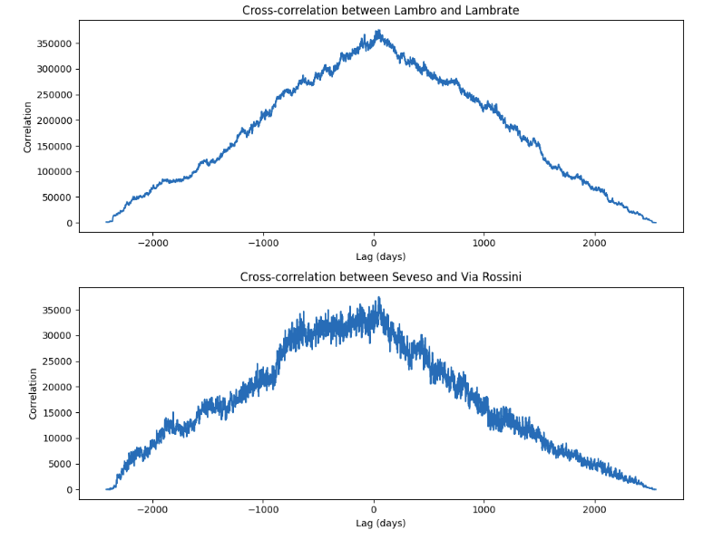

# GreenRoof Optimizer
A smart advisor that analyzes precipitation, temperature, and pollution data across Milan to recommend which rooftops should be converted into green roofs. The system prioritizes locations that maximize environmental impact and optimizes the transition from potential green roofs to actual green spaces within a given budget.

## Table of Contents
- [Dataset](#dataset)
- [Data Analysis](#data-analysis)
- [Algorithm](#algorithm)
- [Future Developments](future-developments)
- [Requirements](#requirements)
- [Usage](#usage)

## Dataset
### Potential Green Roof
The starting point of this project was to establish a ground truth that could provide reliable information about which rooftops could potentially be converted into green roofs. This was made possible thanks to a [GeoJSON file](https://dati.comune.milano.it/dataset/ds1446_tetti-verdi-potenziali)  provided by the Municipality of Milan, which contains the coordinates of rooftops identified as potential green areas. The coordinates are also shown along with the area and ownership of the roof that can be publicly owned by the municipality or privately owned, which plays a crucial role in decision-making and project feasibility.

### Environmental Data
Naturally, to achieve our objective, we require environmental data from different areas of Milan to evaluate where green roof conversions would be most beneficial. Collecting data from multiple locations allows us to make informed, data-driven decisions regarding the optimal placement of new green roofs.  

The environmental data used in this project was obtained through the official [ARPA Lombardia portal](https://www.arpalombardia.it/temi-ambientali/meteo-e-clima/form-richiesta-dati/)  

The dataset includes time series data collected from multiple monitoring stations between 2017 and the end of 2023, covering the following parameters: temperature, air pollution, river levels and precipitation.

The following image shows the locations of various data collection stations. The different colors indicate the type of environmental data collected at each station (e.g., temperature, pollution levels, river monitoring, precipitation).  

- 🔴 **Red** → Temperature monitoring stations  
- 🔵 **Blue** → Precipitation monitoring stations  
- 🟢 **Green** → Air pollution monitoring stations  
- 🟡 **Yellow** → River level monitoring stations  


## Data Analysis
At this stage, we averaged each time series for each monitoring station to better understand whether there were substantial environmental differences across different areas of Milan.  
Our analysis confirmed that these differences do exist, as demonstrated by the three histograms below. These visualizations highlight variations in temperature, pollution levels, and precipitation across different monitoring locations, providing key insights into how environmental factors change throughout the city. This information is crucial for optimizing green roof placement, as certain areas may benefit more from interventions aimed at reducing pollution, mitigating heat, or managing excess rainfall.  

### Temperature
 
The histogram illustrates the average temperature recorded at different monitoring stations across Milan. The red bars represent the warmer months (spring-summer), while the blue bars correspond to the cooler months (autumn-winter).
For this project, we primarily focus on the summer season, as green roofs play a significant role in providing thermal insulation and reducing the urban heat island effect during the hottest months.
Notably, some locations exhibit higher average temperatures, suggesting that introducing green roofs in these areas could be particularly effective in mitigating extreme heat.
### Precipitation
  
The precipitation data highlights the average rainfall levels recorded at different monitoring stations. The stations marked in dark blue are positioned near major rivers, which is particularly relevant since heavy rainfall in these areas can contribute to urban flooding.
Green roofs can help absorb and slow down stormwater runoff, preventing excess water from overwhelming drainage systems and reducing the risk of flooding.
To further analyze the relationship between precipitation and river levels, we performed a cross-correlation analysis, which is displayed below.
 
This graph shows the cross-correlation between precipitation levels and river heights at different time lags. The strong correlation at small lags suggests that heavy rainfall events have an almost immediate effect on river levels. This reinforces the importance of placing green roofs near river-adjacent urban areas to help with flood mitigation.
### Pollution
  
This histogram presents the average NO₂ (Nitrogen Dioxide) pollution levels (µg/m³) measured across different locations in Milan. NO₂ is a major air pollutant, primarily emitted by traffic and industrial activity, and is linked to respiratory diseases and poor urban air quality.

Certain areas, such as Viale Marche and Viale Liguria, exhibit significantly higher NO₂ concentrations, making them prime candidates for green roof interventions aimed at improving air quality.

## Algorithm
Below we try to summarize how the algorithm works. Let us remember again that the goal is is to select the most optimal rooftops in Milan that have the greatest environmental impact if converted into green roofs. This is done based on temperature, precipitation, and pollution criteria while adhering to a predefined budget.
### 1. Collection and Processing of Environmental Data
For each monitoring station, the algorithm calculates the average values of the time series related to each collected environmental parameter which can be:

- Average temperature
- Precipitation levels
- NO₂ concentration (Air pollution)

If a station collects multiple parameters (e.g., precipitation and pollution), each parameter is processed separately.
### 2. Computation of Impact Indices for Each Rooftop
For each rooftop identified in the GeoJSON dataset provided by the Municipality of Milan let's calculate an impact index on all three environmental issues. This is done by computing, for each environmental parameter (temperature, precipitation, pollution), a weighted average of the two nearest stations, where the weight is inversely proportional to the rooftop-station distance:
```math
I = \frac{V_1 \cdot w_1 + V_2 \cdot w_2}{w_1 + w_2} 
```
    
Where:
- $V_1$ and $V_2$ are the environmental values from the two closest stations
- $w_1$ and $w_2$ are the weights, computed as the inverse of the distance between the rooftop and the station $(w_i = \frac{1}{d_i})$
### 3. Normalization of Indices
Impact indices are normalized to a range between 0 and 1 to ensure comparability. Normalization is performed based on the minimum and maximum values within the dataset:
```math
I' = \frac{I - I_{min}}{I_{max} - I_{min}}
```
    
Where $I_{min}$ and $I_{max}$ are the minimum and maximum values recorded for each index.
### 4. Computation of Final Impact Score
For each rooftop, a final impact score is computed using a weighted average of the three normalized indices (precipitation, temperature, pollution). The weights can be configured based on the priority assigned to each environmental parameter.    
```math
I_{final} = P_t \cdot I'_t + P_p \cdot I'_p + P_i \cdot I'_i
```
    
Where:
- $I'_t$, $I'_p$, $I'_i$ are the normalized indices for temperature, precipitation, and pollution.
- $P_t$, $P_p$, $P_i$ are configurable weights.
### 5. Selection of Rooftops Based on Budget
The algorithm receives a budget as input and the desire of choose whether to consider only rooftops owned by the Municipality of Milan or also privately-owned rooftops.
The conversion cost of a rooftop is computed as:
```math    
Cost = Area_{roof} \times Cost_{m^2}
```
    
Where the **cost per square meter** is based on a conversion process that includes only the addition of a grass layer.
Rooftops are sorted by final impact score. The rooftops with the highest impact are selected until the budget is exhausted.
 


### 2. Choice of underlying Satellite Imagery
Once we obtained the GeoJSON file, we needed to use it as a mask on satellite images of Milan to generate the dataset required for training our model. This meant that we had to find high-resolution satellite images that aligned well with our GeoJSON data. However, this proved to be challenging since not many high-resolution satellite maps are publicly available. Additionally, some sources, like Google Maps, had a significant misalignment with our GeoJSON data, making them unsuitable for our needs.

We experimented with overlaying the GeoJSON on different satellite maps, testing Google Maps, Microsoft Azure Maps (formerly Bing Maps), and OpenStreetMap. After thorough evaluation, we found that Azure Maps was the best candidate, as it provided both high-resolution aerial imagery and the best alignment between our GeoJSON coordinates and the satellite images. 
| Azure Map               | Google Map                 |
|-------------------------|----------------------------|
|  |  |

### 3. Map preparation
We decided to create a simple webapp, `map.html` to visualize the map with the option to pan and to enable or disable the geojson mask, we went with this option because azure maps is mostly built to be used on the web, so this was the most documented and straightforward way to use it.

It is possible to see this map by running the `serve` command and opening `localhost:3000/map.html` (or equivalent port on your device) in the browser.

### 4. Dataset collection
We used Playwright to automate the process of capturing the map and the mask, we created a script `captureMap.js` that captures the map and the mask and saves them in the `dataset` folder.
it first goes through all the screenshot for unmasked images, then it enables the mask and pans back to the same coordinates and takes the screenshot with the mask. we decided to do it in this way to avoid waiting for the mask to load every time.

Assuming a good internet connection to load the satellite map, the script can do around 5 screenshots per second.

Some example images are shown below:

| Satellite image | Masked image |
|-----------------|--------------|
|  |  |

### 5. Dataset Preprocessing
At this point, the final step to prepare our dataset for training was to process the masks to ensure they contained only binary pixel values (0 and 1). This meant converting them into black and white labels, where 0 (black) represented potential green roofs and 1 (white) represented all other areas. These binary masks would serve as ground truth labels for our model.

Additionally, we needed to compress the dataset into a more efficient format. The previous script saved raw 600x600 .png images, and with a dataset containing 5000+5000 images, this resulted in a total size of around 5GB.

To optimize storage and speed up the training process, we decided to convert the images and masks into NumPy arrays and store them in a compressed .npz file. This significantly reduced the dataset size while maintaining efficiency for model training.

Below, we provide the function used to convert the screen with the mask into a black and white binary format, along with an example of an input pair (satellite image and corresponding mask) that will be used to train the model.

```python
def preprocess_image_and_mask(image_path, mask_path, target_size=(600, 600)):
    image = cv2.imread(image_path)
    image = cv2.cvtColor(image, cv2.COLOR_BGR2RGB)

    mask = cv2.imread(mask_path)
    mask_rgb = cv2.cvtColor(mask, cv2.COLOR_BGR2RGB)
    magenta = np.array([255, 0, 255])
    binary_mask = np.all(mask_rgb == magenta, axis=-1).astype(np.uint8)
    binary_mask = (1 - binary_mask)  # Invert values: magenta=0, everything else=1
    binary_mask = cv2.resize(binary_mask, target_size, interpolation=cv2.INTER_NEAREST)
    binary_mask = np.expand_dims(binary_mask, axis=-1)  # Add channel dimension
    
    return image, binary_mask
```

| Satellite image | Masked image |
|-----------------|--------------|
|  |  |

## Deep Learning Model

### 1. Approach and Methodology
Once we had our dataset we started building our neural network. To tackle this problem, we employed a **transfer learning** approach. Given the high resolution of the images, we selected architectures that accept 600 × 600 × 3 input dimensions.

Two models were chosen for experimentation:
- **EfficientNetB7**: A highly optimized CNN known for its strong feature extraction capabilities.
- **DeepLabV3+ with ResNet50**: A state-of-the-art segmentation architecture that combines deep residual learning with Atrous Spatial Pyramid Pooling (ASPP).

This report details the implementation of both models. For both models, we experimented with different hyperparameters and empirically determined the best ones. Additionally, we experimented with two different loss functions: Binary Cross-Entropy (BCE) and Focal Loss.

- Binary Cross-Entropy (BCE): This is the standard loss function for binary classification problems. It measures the difference between predicted probabilities and actual labels, penalizing incorrect predictions linearly.

- Focal Loss: A variation of BCE that introduces a focusing parameter (gamma) to reduce the relative importance of well-classified examples, thereby helping to handle class imbalance in segmentation tasks.

### 2. Model Architectures

#### 2.1. EfficientNetB7
We used EfficientNetB7 as a feature extractor, removing its top classification layer and keeping the pre-trained weights frozen to prevent overfitting. The extracted features were then passed through a custom decoder built with Conv2DTranspose layers for upsampling.

##### **Model Implementation**
```python
def build_model(input_shape=(600, 600, 3)):
    base_model = EfficientNetB7(weights='imagenet', include_top=False, input_shape=input_shape)
    base_model.trainable = False  # Freeze pre-trained weights

    inputs = keras.Input(shape=input_shape)
    x = base_model(inputs, training=False)

    # Decoder with Conv2DTranspose for upsampling
    x = layers.Conv2DTranspose(256, (3, 3), strides=2, padding='same', activation='relu')(x)
    x = layers.Conv2DTranspose(128, (3, 3), strides=2, padding='same', activation='relu')(x)
    x = layers.Conv2DTranspose(64, (3, 3), strides=2, padding='same', activation='relu')(x)
    x = layers.Conv2DTranspose(32, (3, 3), strides=2, padding='same', activation='relu')(x)
    x = layers.Conv2DTranspose(16, (3, 3), strides=2, padding='same', activation='relu')(x)

    x = layers.Cropping2D(((4, 4), (4, 4)))(x)

    # Output layer with sigmoid activation for binary segmentation
    outputs = layers.Conv2D(1, (1, 1), activation='sigmoid')(x)

    model = keras.Model(inputs, outputs)
    return model
```

##### **Training, Compilation and Evaluation**
We used a dataset of 5,000 non-normalized images for training. After numerous experiments with different configurations, this was found to be the best setup.

```python
optimizer = 'adam'
loss = keras.losses.BinaryFocalCrossentropy(gamma=2.0, from_logits=True)
metrics = ['accuracy', iou_metric]
batch_size = 20
epochs = 100
early_stopping = keras.callbacks.EarlyStopping(monitor='val_loss', patience=5, restore_best_weights=True)
```
| Metrics | Value | 
|:---------:|:---------:|
|  Accuracy   |   0.9129       |
|  Precision  |   0.9614       |
|  Recall     |   0.9400       |
|  IoU        |   0.6777       |

| Satellite image | Ground truth | Model output |
|---------------------------------|---------------------------------|---------------------------------|
|  |  |  |
|  |  |  |

#### 2.2. DeepLabV3+ with ResNet50
The second approach used DeepLabV3+, an advanced semantic segmentation model that builds on DeepLabV3 by adding a decoder module for improved boundary refinement. It employs ResNet50 as a backbone for feature extraction, utilizing its deep residual connections to capture hierarchical features at different levels.

A key component of DeepLabV3+ is Atrous Spatial Pyramid Pooling. ASPP applies dilated convolutions with different dilation rates (6, 12, 18) to process image features at multiple receptive fields, effectively balancing fine-grained details with broader spatial context. This makes DeepLabV3+ particularly well-suited for segmenting objects of varying sizes within high-resolution satellite images.

##### **Model Implementation**
```python
def build_model(input_shape=(600, 600, 3), num_classes=1):
    base_model = ResNet50(input_shape=input_shape, include_top=False, weights='imagenet')
    base_model.trainable = False  # Freeze ResNet50 weights

    # ASPP Module
    aspp = layers.Conv2D(256, (1, 1), padding="same", use_bias=False)(base_model.output)
    aspp = layers.BatchNormalization()(aspp)
    aspp = layers.ReLU()(aspp)

    aspp = layers.Conv2D(256, (3, 3), dilation_rate=6, padding="same", use_bias=False)(aspp)
    aspp = layers.BatchNormalization()(aspp)
    aspp = layers.ReLU()(aspp)

    aspp = layers.Conv2D(256, (3, 3), dilation_rate=12, padding="same", use_bias=False)(aspp)
    aspp = layers.BatchNormalization()(aspp)
    aspp = layers.ReLU()(aspp)

    aspp = layers.Conv2D(256, (3, 3), dilation_rate=18, padding="same", use_bias=False)(aspp)
    aspp = layers.BatchNormalization()(aspp)
    aspp = layers.ReLU()(aspp)

    # Decoder (Upsampling)
    x = layers.Conv2DTranspose(256, (3, 3), strides=2, padding="same")(aspp)
    x = layers.BatchNormalization()(x)
    x = layers.ReLU()(x)

    x = layers.Conv2DTranspose(128, (3, 3), strides=2, padding="same")(x)
    x = layers.BatchNormalization()(x)
    x = layers.ReLU()(x)

    x = layers.Conv2DTranspose(64, (3, 3), strides=2, padding="same")(x)
    x = layers.BatchNormalization()(x)
    x = layers.ReLU()(x)

    x = layers.Conv2DTranspose(32, (3, 3), strides=2, padding="same")(x)
    x = layers.BatchNormalization()(x)
    x = layers.ReLU()(x)

    x = layers.Cropping2D(((4, 4), (4, 4)))(x)

    # Final output layer with sigmoid activation
    outputs = layers.Conv2D(num_classes, (1, 1), activation='sigmoid')(x)

    model = keras.Model(inputs=base_model.input, outputs=outputs)
    return model
```

#### **Training and Compilation**
We used a dataset of 3,000 normalized images, Less than the previous one due to the limited resources of our development environment. After numerous experiments with different configurations, this was found to be the best setup.
```python
optimizer = 'adam'
loss = 'binary_crossentropy'
metrics = ['accuracy', iou_metric]
batch_size = 8
epochs = 50
early_stopping = keras.callbacks.EarlyStopping(monitor='val_loss', patience=5, restore_best_weights=True)

```
| Metrics | Value | 
|:---------:|:---------:|
|  Accuracy   |   0.9348       |
|  Precision  |   0.9561       |
|  Recall     |   0.9706       |
|  IoU        |   0.7378       |

| Satellite image | Ground truth | Model output |
|---------------------------------|---------------------------------|---------------------------------|
|  |  |  |
|  |  |  |

### 3. Ensamble Model
Given the poor results achieved by the models in the IoU metric, we thought of combining the two to create an ensemble. By combining the predictions of both models and computing their average, we observed a significant improvement in segmentation performance. This ensemble approach leverages the strengths of both architectures: the robust feature extraction of EfficientNetB7 and the detailed spatial understanding of DeepLabV3+. The final output benefits from a more balanced segmentation with improved boundary refinement and generalization capabilities.

| Metrics | Value | 
|:---------:|:---------:|
|  Accuracy   |   0.9500       |
|  Precision  |   0.9759       |
|  Recall     |   0.9668      |
|  IoU        |   0.8251      |

| Satellite image | Ground truth | Model output |
|---------------------------------|---------------------------------|---------------------------------|
|  |  |  |
|  |  |  |

## Future Developments
The results obtained in this project demonstrate the feasibility of using deep learning for automatic green roof segmentation from high-resolution satellite imagery. However, there are several directions in which the model could be further improved and extended to enhance its generalization and usability.
### Testing on Other Cities
Currently, the model has been trained and tested using data from Milan, where both the satellite images and the ground truth masks were well-aligned. A crucial next step would be to evaluate the model's performance on images from different cities to assess how well it generalizes to new environments.

- If the model performs well, it confirms its robustness in different urban landscapes.
- If the model struggles, it may indicate a need for fine-tuning or retraining using data from diverse locations.
By incorporating data from multiple cities, the model could become more adaptable, reducing bias towards a single geographic region.
### Improving Mask Post-Processing
The current output of the model consists of pixel-wise binary segmentation masks, which are useful for classification but lack geometric precision. In practice, green roofs are best represented as polygonal shapes rather than rasterized masks.

A possible future improvement is to apply post-processing techniques to refine the segmentation results:

- Polygon Approximation: Convert pixel-based masks into vector-based polygonal representations, making the results more interpretable for urban planners.
- Morphological Operations: Use techniques such as contour detection and edge smoothing to clean up jagged segmentation outputs.
This would align the model's output with real-world applications, as city administrations typically work with vector-based GIS data rather than pixel-based masks.

## Requirements

- Node.js (tested with v18.0.0)
- Python 3 (tested with 3.12.4)

## Usage
### Dataset Creation Instructions
To generate the dataset, follow these steps carefully:

#### 1. Install Dependencies
Before running any script, you need to install the required dependencies. Run the following command in your terminal:

```sh
npm install
```
This will install all necessary Node.js packages listed in the package.json file.

Additionally, the dataset generation process uses Playwright, a tool for browser automation. To install Playwright, run:
```sh
npx playwright install
```
This ensures that all required browser engines are available for capturing satellite images.
#### 2. Configure Azure Key
The script uses Azure Maps for satellite imagery. To enable this, you must replace the placeholder key in the map.html file with your personal Azure Maps key. To obtain an Azure Maps key:

- Go to the [Azure Portal](https://azure.microsoft.com/de-de/get-started/azure-portal/).

- Create a new Azure Maps account if you don’t already have one.

- Navigate to "Keys" and copy your primary key.

- Open map.html and locate the placeholder key in the script.

- Replace it with your actual Azure Maps key.

#### 3. Start the Local Server
The dataset creation script relies on a local server to load map tiles and capture images. Start the server with:
```sh
serve
```
After running this command, a port number will be displayed in the terminal (e.g., http://localhost:3000).
#### 4. Configure the Capture Script
Copy the port number from the terminal output and paste it into the `captureMap.js`. You will typically need to update a line in the script where the local server address is defined, ensuring the script can properly load the satellite maps.
#### 5. Run the Dataset Creation Script
Once the server is running and the correct port is set, execute the dataset generation script:
```sh
node captureMap.js
```
This script will:
- Load satellite images from the local server.
- Capture screenshots of the map tiles.
- Save the images as part of the dataset for training the model.
- After execution, your dataset will be available in the specified output directory.
### Models Training

#### 1. Dependencies Installation

Before training the models, you need to install the necessary Python dependencies. Run the following command:

```sh
pip install -r requirements.txt
```
#### 2. Preprocessing the Dataset
Before training, the dataset must be preprocessed to ensure it's in the correct format. Run the preprocessing script:

```sh
python3 preprocessing.py
```
This script will convert masks into the correct binary format and save the preprocessed data in the structured format (npz) for training.

#### 3. Train the Models
You can train the two different deep learning models using the following command:

```sh
python3 DeepLabV3.py
```
This model is based on the DeepLabV3+ architecture and uses ResNet50 as its feature extractor.

```sh
python3 EfficientNetB7.py
```
This model utilizes EfficientNetB7, a highly efficient CNN architecture for feature extraction.

#### 4. Model Inference & Evaluation
Once the models are trained, you can evaluate them and use them for inference.

To test both trained models and their ensemble version, open and run the Evaluation Notebook.
