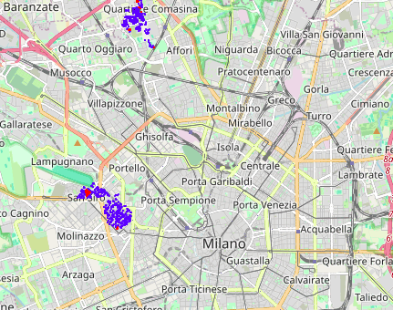

# GreenRoof Optimizer
A smart advisor that analyzes precipitation, temperature, and pollution data across Milan to recommend which rooftops should be converted into green roofs. The system prioritizes locations that maximize environmental impact and optimizes the transition from potential green roofs to actual green spaces within a given budget.

## Table of Contents
- [Dataset](#dataset)
- [Data Analysis](#data-analysis)
- [Algorithm](#algorithm)
- [Results](#results)
- [Future Developments](#future-developments)
- [Requirements](#requirements)
- [Usage](#usage)

## Dataset
### Potential Green Roof
The starting point of this project was to establish a ground truth that could provide reliable information about which rooftops could potentially be converted into green roofs. This was made possible thanks to a [GeoJSON file](https://dati.comune.milano.it/dataset/ds1446_tetti-verdi-potenziali)  provided by the Municipality of Milan, which contains the coordinates of rooftops identified as potential green areas. The coordinates are also shown along with the area and ownership of the roof that can be publicly owned by the municipality or privately owned, which plays a crucial role in decision-making and project feasibility.

### Environmental Data
Naturally, to achieve our objective, we require environmental data from different areas of Milan to evaluate where green roof conversions would be most beneficial. Collecting data from multiple locations allows us to make informed, data-driven decisions regarding the optimal placement of new green roofs.  

The environmental data used in this project was obtained through the official [ARPA Lombardia portal](https://www.arpalombardia.it/temi-ambientali/meteo-e-clima/form-richiesta-dati/)  

The dataset includes time series data collected from multiple monitoring stations between 2017 and the end of 2023, covering the following parameters: temperature, air pollution, river levels and precipitation.

The following image shows the locations of various data collection stations. The different colors indicate the type of environmental data collected at each station (e.g., temperature, pollution levels, river monitoring, precipitation).  

- 🔴 **Red** → Temperature monitoring stations  
- 🔵 **Blue** → Precipitation monitoring stations  
- 🟢 **Green** → Air pollution monitoring stations  
- 🟡 **Yellow** → River level monitoring stations  


## Data Analysis
At this stage, we averaged each time series for each monitoring station to better understand whether there were substantial environmental differences across different areas of Milan.  
Our analysis confirmed that these differences do exist, as demonstrated by the three histograms below. These visualizations highlight variations in temperature, pollution levels, and precipitation across different monitoring locations, providing key insights into how environmental factors change throughout the city. This information is crucial for optimizing green roof placement, as certain areas may benefit more from interventions aimed at reducing pollution, mitigating heat, or managing excess rainfall.  

### Temperature
 
The histogram illustrates the average temperature recorded at different monitoring stations across Milan. The red bars represent the warmer months (spring-summer), while the blue bars correspond to the cooler months (autumn-winter).
For this project, we primarily focus on the summer season, as green roofs play a significant role in providing thermal insulation and reducing the urban heat island effect during the hottest months.
Notably, some locations exhibit higher average temperatures, suggesting that introducing green roofs in these areas could be particularly effective in mitigating extreme heat.
### Precipitation
  
The precipitation data highlights the average rainfall levels recorded at different monitoring stations. The stations marked in dark blue are positioned near major rivers, which is particularly relevant since heavy rainfall in these areas can contribute to urban flooding.
Green roofs can help absorb and slow down stormwater runoff, preventing excess water from overwhelming drainage systems and reducing the risk of flooding.
To further analyze the relationship between precipitation and river levels, we performed a cross-correlation analysis, which is displayed below.
 
This graph shows the cross-correlation between precipitation levels and river heights at different time lags. The strong correlation at small lags suggests that heavy rainfall events have an almost immediate effect on river levels. This reinforces the importance of placing green roofs near river-adjacent urban areas to help with flood mitigation.
### Pollution
  
This histogram presents the average NO₂ (Nitrogen Dioxide) pollution levels (µg/m³) measured across different locations in Milan. NO₂ is a major air pollutant, primarily emitted by traffic and industrial activity, and is linked to respiratory diseases and poor urban air quality.

Certain areas, such as Viale Marche and Viale Liguria, exhibit significantly higher NO₂ concentrations, making them prime candidates for green roof interventions aimed at improving air quality.

## Algorithm
Below we try to summarize how the algorithm works. Let us remember again that the goal is is to select the most optimal rooftops in Milan that have the greatest environmental impact if converted into green roofs. This is done based on temperature, precipitation, and pollution criteria while adhering to a predefined budget.
### 1. Collection and Processing of Environmental Data
For each monitoring station, the algorithm calculates the average values of the time series related to each collected environmental parameter which can be:

- Average temperature
- Precipitation levels
- NO₂ concentration (Air pollution)

If a station collects multiple parameters (e.g., precipitation and pollution), each parameter is processed separately.
### 2. Computation of Impact Indices for Each Rooftop
For each rooftop identified in the GeoJSON dataset provided by the Municipality of Milan let's calculate an impact index on all three environmental issues. This is done by computing, for each environmental parameter (temperature, precipitation, pollution), a weighted average of the two nearest stations, where the weight is inversely proportional to the rooftop-station distance:
```math
I = \frac{V_1 \cdot w_1 + V_2 \cdot w_2}{w_1 + w_2} 
```
    
Where:
- $V_1$ and $V_2$ are the environmental values from the two closest stations
- $w_1$ and $w_2$ are the weights, computed as the inverse of the distance between the rooftop and the station $(w_i = \frac{1}{d_i})$
### 3. Normalization of Indices
Impact indices are normalized to a range between 0 and 1 to ensure comparability. Normalization is performed based on the minimum and maximum values within the dataset:
```math
I' = \frac{I - I_{min}}{I_{max} - I_{min}}
```
    
Where $I_{min}$ and $I_{max}$ are the minimum and maximum values recorded for each index.
### 4. Computation of Final Impact Score
For each rooftop, a final impact score is computed using a weighted average of the three normalized indices (precipitation, temperature, pollution). The weights can be configured based on the priority assigned to each environmental parameter.    
```math
I_{final} = P_t \cdot I'_t + P_p \cdot I'_p + P_i \cdot I'_i
```
    
Where:
- $I'_t$, $I'_p$, $I'_i$ are the normalized indices for temperature, precipitation, and pollution.
- $P_t$, $P_p$, $P_i$ are configurable weights.
### 5. Selection of Rooftops Based on Budget
The algorithm receives a budget as input and the desire of choose whether to consider only rooftops owned by the Municipality of Milan or also privately-owned rooftops.
The conversion cost of a rooftop is computed as:
```math    
Cost = Area_{roof} \times Cost_{m^2}
```
    
Where the **cost per square meter** is based on a conversion process that includes only the addition of a grass layer.
Rooftops are sorted by final impact score. The rooftops with the highest impact are selected until the budget is exhausted.

## Results
Below, we present two examples showcasing how the algorithm prioritizes green roof placements under different budget constraints. These scenarios illustrate how adjusting the weighting of environmental factors (temperature, pollution, and precipitation) influences the final selection of rooftops for conversion. 
### Focus on floods
In this scenario, we set the weights to prioritize green roof placements that primarily combat urban flooding. By assigning the highest weight to precipitation, the algorithm selects rooftops in areas where excessive rainfall and stormwater management are critical concerns.

| Input | Value | 
|:---------:|:---------:|
|  Budget  |  10'000'000€  |
|  Temperature weight  |  2  |
|  Pollution weight  |  1  |
|  Precipitation weight  |  5  |

The following maps depict the selected rooftops, differentiating between those owned exclusively by the Municipality of Milan and those including privately owned buildings.

| Only municipally owned roofs | Any roof | 
|:---------:|:---------:|
|    |   |

### Focus on all three issues
In this scenario, we distribute equal weight across temperature reduction, pollution mitigation, and precipitation management. This approach allows the algorithm to select rooftops that offer an evenly distributed environmental benefit rather than favoring one specific concern.

| Input | Value | 
|:---------:|:---------:|
|  Budget  |  30'000'000€  |
|  Temperature weight  |  3  |
|  Pollution weight  |  3  |
|  Precipitation weight  |  3  |

Below is the output of the algorithm selecting only municipally owned roofs:


## Future Developments
### Improving Cost Estimation
Currently, the model estimates the cost of green roof conversion using a fixed price per square meter, considering only the addition of a grass layer. However, real-world implementation costs may vary significantly based on factors such as structural reinforcements, irrigation systems, and the type of vegetation used. Future developments will focus on refining these estimates by incorporating:

- Real construction and maintenance costs from existing green roof projects.
- Different types of green roof solutions (e.g., extensive vs. intensive).
- Economies of scale when implementing multiple green roofs within the same area. This will provide a more realistic financial outlook for decision-makers, ensuring that budget allocation is optimized.

### Simulating Alternative Scenarios
To quantify the real impact of green roof interventions, we aim to develop a predictive model that simulates how environmental conditions would have evolved if suggested green roof conversions had been implemented two years ago. By leveraging time-series forecasting techniques, we can compare simulated historical data with actual recorded values, enabling a direct assessment of:

- The reduction in peak summer temperatures.
- The mitigation of flood risks in areas with heavy precipitation.
- The improvement in air quality due to NO₂ absorption.

This retrospective analysis will provide stakeholders with concrete evidence of the effectiveness of green roof adoption, strengthening the case for future investments in sustainable urban infrastructure.

## Requirements
To run this script, ensure you have the following packages installed:

### Python Version
Python 3.8 or higher
### Required Libraries
Install the required Python libraries using pip:

```bash
pip install geopandas folium matplotlib
```
		
| Library | Version | Description |
|:---------:|:---------:|:---------:|
|math |	Built-in |	Provides mathematical functions |
|json |	Built-in |	Handles JSON file input and output |
|geopandas |	>=0.12 |	For handling and processing GeoJSON data |
|folium |	>=0.14 |	For generating interactive maps in HTML |


## Usage
